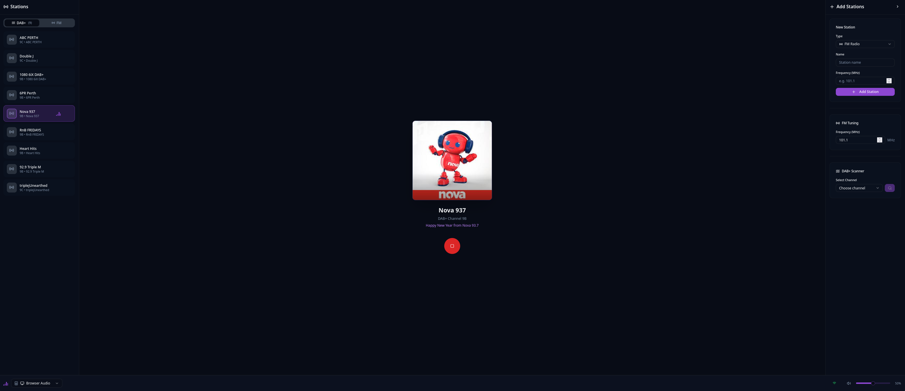
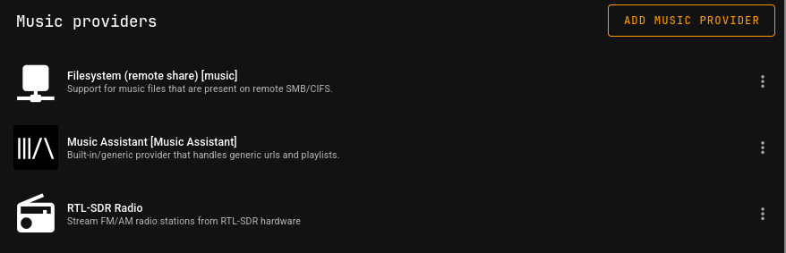

# RTL-SDR Radio

Stream FM/AM and DAB+ radio from an [RTL-SDR](https://www.rtl-sdr.com/about-rtl-sdr/) dongle to Chromecast speakers or via Music Assistant.



## Features

- **FM/AM Radio** - Tune to analog radio stations
- **DAB+ Radio** - Receive digital radio with channel scanning
- **Chromecast Support** - Stream directly to Chromecast/Google Home devices
- **Music Assistant Integration** - Custom provider exposes stations as radio items
- **Squeezelite Support** - Play to Squeezelite players via Music Assistant's Slimproto
- **Auto-Fetch Logos** - Station artwork fetched automatically from RadioBrowser
- **Home Assistant Automations** - Control playback via HA through Music Assistant

## Architecture

```
┌─────────────────┐     ┌─────────────────────────────────┐     ┌────────────────┐
│   Web Frontend  │────▶│        FastAPI Backend          │────▶│   Chromecast   │
│     (React)     │     │                                 │     └────────────────┘
└─────────────────┘     │  ┌───────────┐  ┌────────────┐  │
                        │  │  rtl_fm   │─▶│  ffmpeg    │  │◀── FM/AM
                        │  │  process  │  │  transcoder│  │
                        │  └───────────┘  └────────────┘  │
                        │                                 │
                        │  ┌───────────────────────────┐  │
                        │  │   welle-cli (DAB+)        │  │◀── DAB+
                        │  └───────────────────────────┘  │
                        └─────────────────────────────────┘
                                        │
                                        ▼
                        ┌─────────────────────────────────┐     ┌────────────────┐
                        │       Music Assistant           │────▶│  Squeezelite   │
                        │    (RTL-SDR Radio Provider)     │     │    Players     │
                        └─────────────────────────────────┘     └────────────────┘
                                        │
                                        ▼
                        ┌─────────────────────────────────┐
                        │        Home Assistant           │
                        │         (Automations)           │
                        └─────────────────────────────────┘
```

## Quick Start

```bash
# Clone the repository
git clone https://github.com/SeanoNET/rtlsdr-radio.git
cd rtlsdr-radio

# Start all services
docker-compose up -d
```

| Service | Port | URL |
|---------|------|-----|
| Frontend | 80 | http://localhost |
| Backend API | 8000 | http://localhost:8000 |
| Music Assistant | 8095 | http://localhost:8095 |

## Configuration

### Environment Variables

| Variable | Default | Description |
|----------|---------|-------------|
| `EXTERNAL_STREAM_URL` | _(none)_ | HTTPS URL for Chromecast streaming (required for Chromecast) |
| `DEFAULT_STATIONS` | `all` | Station presets mode (see below) |

### DEFAULT_STATIONS Modes

| Mode | Description |
|------|-------------|
| `all` | FM defaults + DAB+ discovery enabled (default) |
| `fm` | FM stations only |
| `dab` | DAB+ only - use channel scan to discover stations |
| `none` | No default stations - start empty |

The default FM stations are example presets for Perth, WA. You can delete these and add your own local stations.

## Music Assistant Setup

1. Open Music Assistant at `http://localhost:8095`
2. Go to **Settings → Providers → Add Provider**
3. Select **RTL-SDR Radio**
4. Configure:
   - **Host**: `rtlsdr-backend` (or your backend IP)
   - **Port**: `8000`
5. Click **Save**

### DAB+ Auto-Discovery (Optional)

Enable automatic discovery of DAB+ programs:

| Setting | Description |
|---------|-------------|
| **Enable DAB+ Auto-Discovery** | Scan configured channels on sync |
| **DAB+ Channels to Scan** | Comma-separated channel IDs (e.g., `9A,9B,9C`) |

Discovered DAB+ programs will appear alongside your saved stations in Music Assistant.



## Using DAB+ Radio

### Web UI

1. Select a speaker (browser or Chromecast)
2. Choose a DAB+ channel from the dropdown
3. Click **Scan** to discover programs
4. Click a program to play, or **Add** to save it as a station

### Adding DAB+ Stations

DAB+ stations require:
- **Channel**: The DAB+ channel (e.g., `9A`, `9B`, `9C`)
- **Program Name**: The station name on that channel
- **Service ID**: Unique identifier for the program

## Home Assistant Automations

Control radio playback via Home Assistant automations through Music Assistant:

```yaml
service: mass.play_media
data:
  media_id: "Nova 93.7"
  entity_id: media_player.kitchen_speaker
```

## API

The backend provides a REST API for all operations.

- **Interactive docs**: http://localhost:8000/docs
- **OpenAPI spec**: http://localhost:8000/openapi.json

Key endpoints:
- `GET /api/stations` - List stations
- `GET /api/dab/channels` - List DAB+ channels
- `GET /api/dab/programs?channel=9A` - Scan for programs
- `GET /api/stream` - Audio stream (MP3)

## Migration Notes

### LMS/Squeezebox Users

Direct Squeezebox/LMS player control has been removed. To play to Squeezelite players:

1. Install the **Slimproto provider** in Music Assistant
2. Configure your Squeezelite players in MA
3. RTL-SDR Radio stations will be available as radio sources

This approach provides better integration with Home Assistant and other MA features.

## Development

### Backend

```bash
cd backend
python -m venv venv
source venv/bin/activate
pip install -r requirements.txt
uvicorn app.main:app --host 0.0.0.0 --port 8000 --reload
```

### Frontend

```bash
cd frontend
npm install
npm run dev
```

## Troubleshooting

### RTL-SDR not detected

```bash
# Check USB connection
lsusb | grep -i rtl

# Create udev rule
echo 'SUBSYSTEM=="usb", ATTRS{idVendor}=="0bda", ATTRS{idProduct}=="2838", MODE="0666"' | sudo tee /etc/udev/rules.d/99-rtlsdr.rules
sudo udevadm control --reload-rules
```

### Stations not appearing in Music Assistant

1. Check provider is configured with correct host/port
2. Verify backend is reachable: `curl http://localhost:8000/api/stations`
3. Trigger a library sync in MA: **Settings → Providers → RTL-SDR Radio → Sync**

### Chromecast not found

- Ensure devices are on the same network
- Check firewall allows mDNS (port 5353 UDP)

### DAB+ not working

- Ensure `welle-cli` is installed in the backend container
- Check your RTL-SDR supports the DAB+ frequency range
- Try different channels - not all channels have active multiplexes in your area
